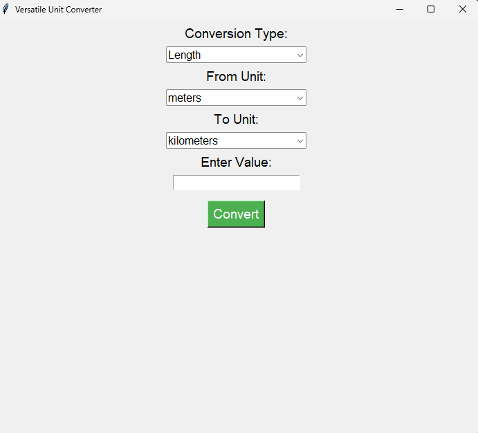
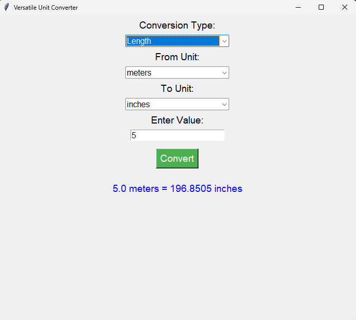
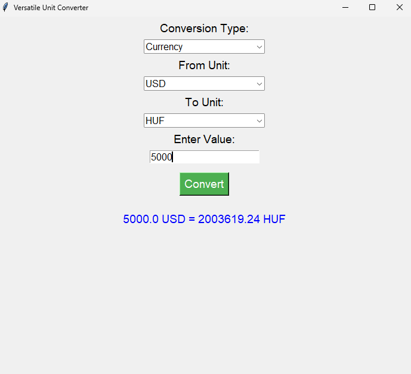

# Unit Converter
A versatile unit converter that supports multiple types of conversions, including length, mass, temperature, volume, area, speed, time, energy, pressure, data storage, data transfer rate, angle, frequency, fuel economy, and real-time currency conversion.
## Features
- Comprehensive Conversion Types:
  - Length, Mass, Temperature, Volume, Area, Speed, Time, Energy, Pressure.
  - Data Storage, Data Transfer Rate, Frequency, Fuel Economy, Angle, and Currency.
- Real-Time Currency Conversion:
  - Converts between over 30 currencies using a live exchange rate API.
- Interactive GUI:
  - Easy-to-use interface with dropdowns for conversion type and units.
  - Input field for entering values and real-time display of results.
- Adaptive Precision:
  - Results are dynamically rounded for readability while maintaining accuracy.
- Extensible Design:
  - Easy to add more conversion factors or update existing ones.
## Screenshots



## Requirements
The following libraries are required to run the Unit Converter:
- `tkinter`: This is used to build the graphical user interface.
- `requests`: To fetch live currency exchange rates.
You can install these dependencies using:
  ```bash
  pip install requests
## Installation
1. Clone this repository
   ```bash
   git clone https://github.com/DeAsiaMcQueen/Unit-Converter.git
2. Navigate to the project directory
   ```bash
   cd Unit-Converter
3. Install dependencies
   ```bash
   pip install -r requirements
4. Run the application
## Usage
1. Launch the Unit Converter application
2. Select a Conversion Type from the dropdown menu
3. Choose the From Unit and To Unit
4. Enter the value you want to convert
5. Click the Convert button to display the result
## Future Enhancements
1. Add more unit types and conversion factors
2. Include historical currency exchange rates
3. Support for batch conversions (converting multiple values simultaneously)
4. A responsive web-based version of the Unit Converter
## License
This project is licensed under the MIT License. Please look at the [LICENSE](LICENSE) file for details.
## Contributing
We welcome contributions from the community! Please see our [CONTRIBUTING.md](CONTRIBUTING.md) file for detailed guidelines.
When submitting a pull request, follow the steps outlined in our [Pull Request Template](.github/PULL_REQUEST_TEMPLATE.md).
## Code of Conduct
This project adheres to a [Code of Conduct](CODE_OF_CONDUCT.md). By participating, you are expected to uphold this code.
## Changelog
All notable changes to this project are documented in the [Changelog](CHANGELOG.md).
## Acknowledgments
1. Open Exchange Rates provides to provide real-time currency exchange rates.
2. Python Community: For maintaining libraries like tkinter and requests.
